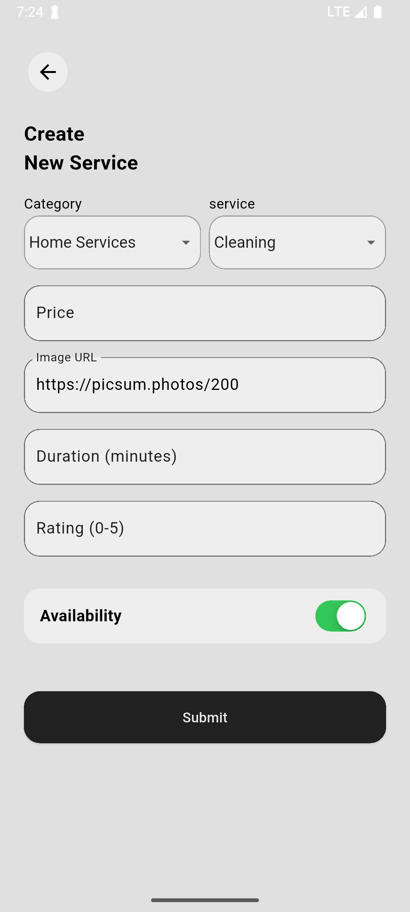
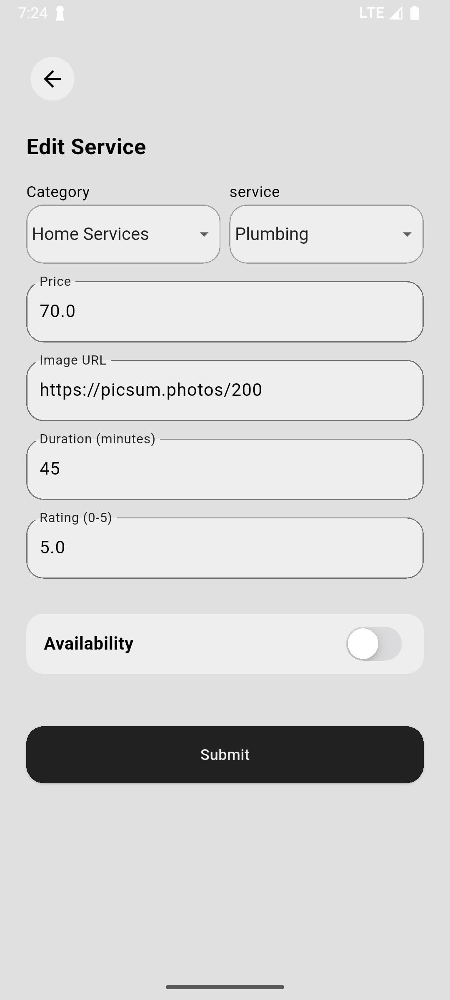
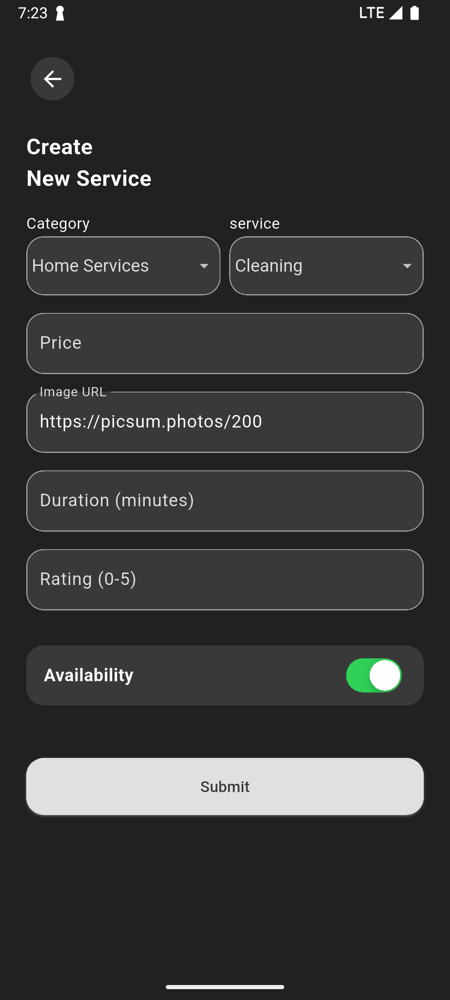
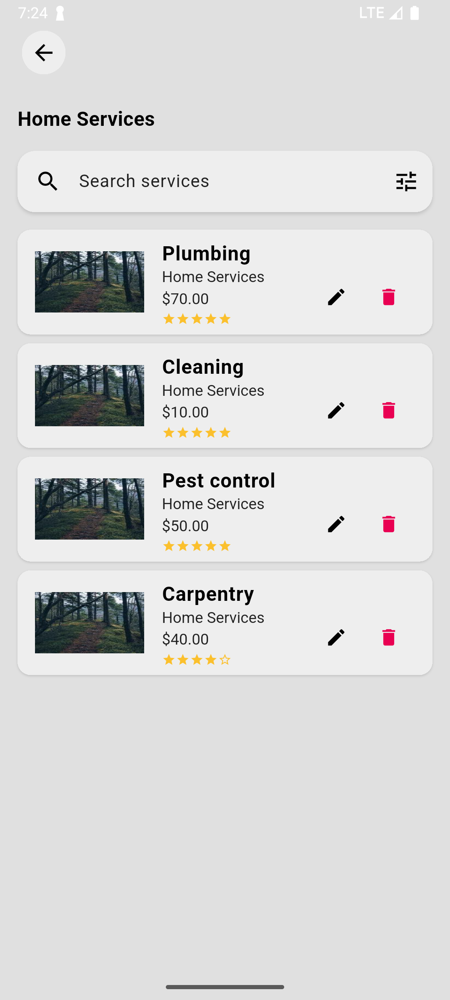
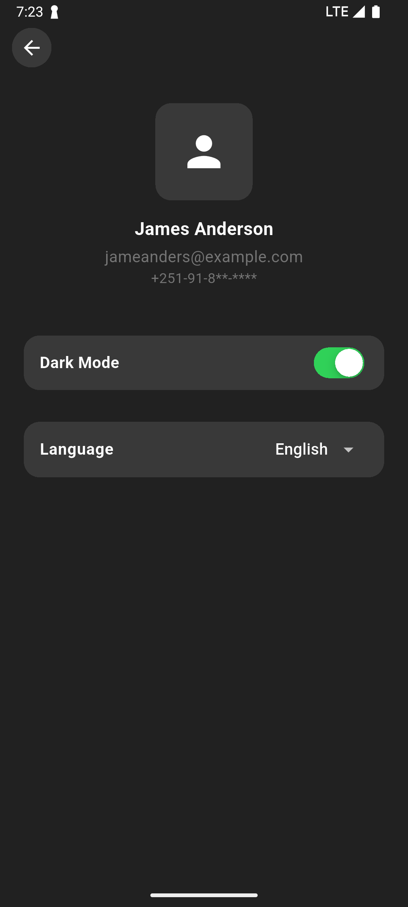
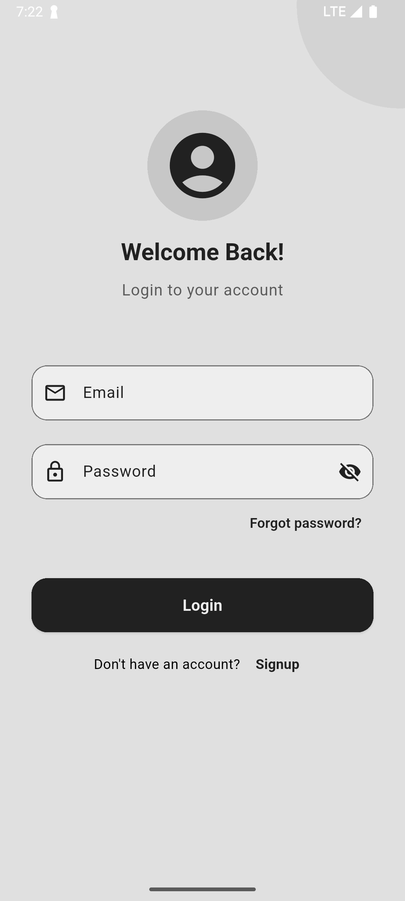

# Mini Service Booking App

A Flutter-based frontend application for managing services with full CRUD functionality, built using GetX for state management and Clean Architecture principles. The app consumes a public REST API from [mockapi.io](https://mockapi.io/) and includes advanced features like multi-language support, local persistence with Hive, custom UI components, and a responsive design with animations.

## Project Overview

The Mini Service Booking App enables users to manage services, including creating, viewing, editing, and deleting them. Each service includes attributes such as name, category, price, image URL, availability, duration, and rating. The app leverages GetX for state management, routing, and dependency injection, follows Clean Architecture for modularity, and integrates with a public REST API. Enhanced features include search/filtering, multi-language support (English, Spanish, French, Amharic), theme switching, pagination, local persistence, and smooth animations.

## Setup Instructions

Follow these steps to set up and run the project locally:

1. **Prerequisites**:

   - Flutter SDK (>=3.0.0)
   - Dart
   - An IDE (e.g., VS Code, Android Studio)
   - An emulator or physical device

2. **Clone the Repository**:

   ```bash
   git clone https://github.com/henokcheklie/mini_service_booking_app.git
   cd mini_service_booking_app
   ```

3. **Install Dependencies**:

   ```bash
   flutter pub get
   ```

4. **Generate Hive Adapters**:

   ```bash
   flutter pub run build_runner build --delete-conflicting-outputs
   ```

   This generates the `service_model.g.dart` file for Hive local persistence.

5. **Run the App**:
   ```bash
   flutter run
   ```

**Note**: Ensure a valid `mockapi.io` endpoint is configured. The API base URL is defined in `lib/core/constants.dart`. Replace it with your own endpoint if necessary.

## Screenshots

### Home Screen

Displays a scrollable list with search and filter options.

<p float="left">
  
   
  
  
</p>

### Service Detail Screen

Shows detailed service info with Hero animations.

<p float="left">
  
  
</p>

### Add/Edit Service Screen

Features custom dropdowns, validation, and multi-language support.

<p float="left">
  
  
  
</p>

### Service List Screen

Displays a scrollable list with search and filter options.

<p float="left">
  
</p>

### Profile Screen

Allows language and theme switching.

<p float="left">
  
  
</p>

### Login Screen

Allows users to authenticate

<p float="left">
  
</p>

## Implemented Features

### Core Features

- **Full CRUD Operations**:
  - **Create**: Add services via a form with fields for name, category, price, image URL, availability, duration, and rating.
  - **Read**: View services in a performant `ListView.builder` or detailed view with Hero animations.
  - **Update**: Edit services with pre-filled forms and robust validation.
  - **Delete**: Remove services with a confirmation dialog.
- **GetX Integration**:
  - Uses GetX for state management, routing, and dependency injection via `ServiceBinding`.
  - Reactive UI updates with `Obx` and `GetX` widgets.
- **Clean Architecture**:
  - Structured into `presentation` (UI), `domain` (business logic), and `data` (API/local storage) layers.
  - Implements use cases, repositories, and data sources for modularity.
- **REST API Integration**:
  - Consumes a public REST API from `mockapi.io` for CRUD operations.
- **UI/UX**:
  - Responsive Material Design with custom widgets (`CustomDropDown`, `CustomSwitchTile`, `ImageLoader`).
  - Loading indicators, snackbar notifications, and inline form validation.
  - Disabled submit button when form is invalid.
- **Error Handling**:
  - Manages API errors, network issues, and edge cases with user-friendly messages.
  - Falls back to Hive-cached data during API failures.

### Bonus Features

- **Multi-Language Support**:
  - Supports English (`en_US`), Spanish (`es_ES`), French (`fr_FR`), and Amharic (`am_ET`) with persistent language switching via `LanguageController`.
  - Custom translations in `core/translations` and Flutter’s `localizationsDelegates` for Material widgets.
  - Language switcher in `ServiceForm` and `ProfileScreen` with Hive persistence.
- **Search and Filter**:
  - Real-time search by name or category using `CustomSearchBar`.
  - Advanced filtering via `ServiceFilterModal` for category, price range, and availability.
- **Local Persistence**:
  - Hive caches services locally for offline access.
  - Persists language and theme preferences in a `settings` box.
- **Theme Switching**:
  - Dynamic light/dark theme switching via `ThemeController`.
  - Persisted theme settings using Hive.
- **Animations and Transitions**:
  - Hero animations for transitions between `ServiceListScreen` and `ServiceDetailScreen`.
  - Smooth UI interactions with custom widgets.
- **Custom Widgets**:
  - `CustomBackButton`: Consistent navigation across screens.
  - `CustomDropDown`: Reusable dropdown for categories, service names, and languages.
  - `CustomSearchBar`: Real-time search input with debouncing.
  - `CustomSwitchTile`: Styled toggle for availability.
  - `ImageLoader`: Optimized image loading with `CachedNetworkImage` and error handling.
  - `ServiceFilterModal`: Modal bottom sheet for advanced filtering.
- **Pagination**:
  - Lazy loading of services in `ServiceListScreen` for performance.
- **Authentication**:
  - `LoginScreen` with `LoginController` for user authentication.
- **Pull to Refresh**:
  - Pull to refresh support

## Folder Structure

The project adheres to Clean Architecture with a modular structure:

```
lib/
├── core/                         # Shared utilities, constants, themes, translations
│   ├── constants.dart            # API endpoints, Hive box names
│   ├── theme/                    # Theme configuration
│   │   ├── theme_controller.dart
│   │   └── theme_data.dart
│   ├── translations/             # Multi-language support
│   │   ├── am_ET.dart
│   │   ├── en_US.dart
│   │   ├── es_ES.dart
│   │   ├── fr_FR.dart
│   │   └── translations.dart
│   └── utils/
│       └── validators.dart       # Form validation logic
├── data/                         # Data layer (API, local storage, models)
│   ├── datsource/
│   │   ├── locale/
│   │   │   └── service_local_datasource.dart
│   │   └── remote/
│   │       └── service_remote_datasource.dart
│   ├── models/
│   │   ├── service_model.dart
│   │   └── service_model.g.dart
│   └── repositories/
│       └── service_repository_impl.dart
├── domain/                        # Business logic
│   ├── entities/
│   │   └── service.dart
│   ├── repositories/
│   │   └── service_repository.dart
│   └── usecase/
│       ├── add_service.dart
│       ├── delete_service.dart
│       ├── get_services.dart
│       └── update_service.dart
├── presentation/                   # UI layer
│   ├── bindings/
│   │   └── service_binding.dart
│   ├── controllers/
│   │   ├── language_controller.dart
│   │   ├── login_controller.dart
│   │   └── service_controller.dart
│   ├── screens/
│   │   ├── auth/
│   │   │   └── login_screen.dart
│   │   ├── home_screen.dart
│   │   ├── profile/
│   │   │   └── profile_screen.dart
│   │   ├── service_add_edit_screen.dart
│   │   ├── service_detail_screen.dart
│   │   └── service_list_screen.dart
│   └── widgets/
│       ├── custom_back_button.dart
│       ├── custom_drop_down.dart
│       ├── custom_search_bar.dart
│       ├── custom_switch_tile.dart
│       ├── image_loader.dart
│       ├── service_card.dart
│       ├── service_filter_modal.dart
│       └── service_form.dart
└── main.dart                    # App entry point
```

- **core**: Constants, themes, translations, and validation utilities.
- **data**: Manages API calls, Hive storage, and data models.
- **domain**: Business logic with entities, use cases, and repository interfaces.
- **presentation**: UI screens, GetX controllers, bindings, and reusable widgets.
- **main.dart**: Initializes Hive, sets up GetX, and configures the app.

## Dependencies

Key dependencies used in the project:

- `flutter`: Core Flutter SDK
- `get`: GetX for state management, routing, and dependency injection
- `hive` & `hive_flutter`: Local persistence
- `http`: API requests
- `cached_network_image`: Optimized image loading
- `smooth_star_rating_null_safety`: Rating display
- `flutter_launcher_icons`: To generate aoo icon
- `build_runner` & `hive_generator`: Code generation for Hive

View the full list in `pubspec.yaml`.

## Future Improvements

- Implement push notifications for service updates.
- Support additional languages (e.g., Arabic, Chinese).
- Integrate a backend authentication service (e.g., Firebase).
